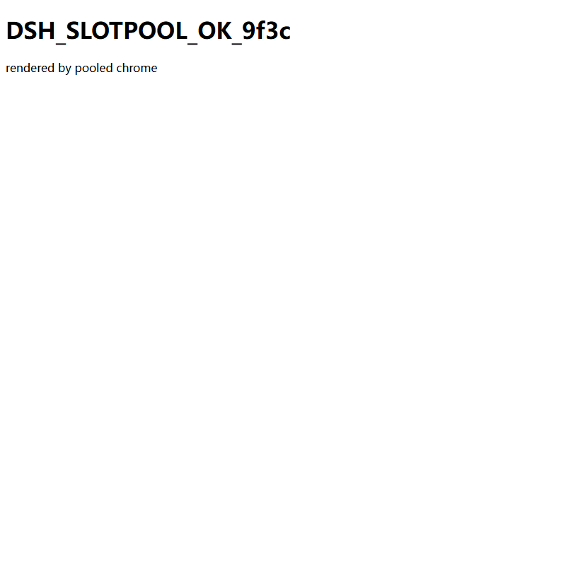

<p align="center">中文 · <a href="./README.en.md">English</a></p>

# dsh-browser-slotpool — 并发浏览器槽位池插件

给 DeepSeek Harness 的 `mcp-client` 一个 **并发、幂等、互不破坏、崩了能自愈** 的浏览器 MCP。它只是一个 **patch 层 bundle**：往 profile 里加一条 `@deepseek-ai/dsh-mcp-client` 实例，`command`/`args` 指向本包自带的 `bin/browser-slotpool.mjs`（由该启动器管理槽位池）。浏览器工具以 `mcp__browser__<rawName>` 出现在模型面前。

端到端本地验证（本地服务器 + 池化 Chrome 真实渲染，非 mock）：



```
[browser-slotpool] Claimed slot port 9222 (pid 35196)
[browser-slotpool] Rule: each slot is an independent session — never proxy or steal another slot.
[browser-slotpool] Starting Chrome for slot 9222: C:/Program Files/Google/Chrome/Application/chrome.exe
[browser-slotpool] Chrome ready on 9222
[browser-slotpool] Launching Playwright MCP -> http://127.0.0.1:9222
== initialize: Playwright
== tools: 31 | browser_close, browser_resize, browser_console_messages, browser_handle_dialog, browser_evaluate, browser_file_upload ...
== navigate: OK
== screenshot bytes: 14140
== snapshot contains marker: true
== SMOKE PASS (rendered real page in pooled chrome) ==
```

## 它解决什么

多会话/多 profile 共用浏览器时，各自起实例会端口冲突、内存爆炸、互相干扰；共用一个又会争抢。本 bundle 用**槽位池**把实例上限显式化：

- **槽位池**：固定 N 个 CDP 端口（默认 `9222,9223`），先到先得，满即拒绝并提示。
- **原子加锁**：`fs.openSync(lock, "wx")`（O_EXCL 独占创建）无竞态加锁。
- **PID 活性 + 陈旧锁自愈**：持有者死了自动回收，不会永久"槽全忙"。
- **幂等就绪探测**：CDP 端口已起就不动，没起才 spawn Chrome；**绝不杀别的槽的浏览器**。
- **槽位所有权隔离**：每个 mcp-client 会话独占一个端口，不 proxy、不偷别人的槽。
- stdio 全委托给 `@playwright/mcp`；诊断只走 stderr（保住 MCP 协议通道）。

## 安装

推荐从 GitHub 安装（无需本地构建）：

```sh
# 从 DeepSeek Harness checkout 目录执行（与 GUI 所在 profile 一致时）
pnpm dsh plugin --profile web add github:bluechips-zhao/dsh-browser-slotpool
```

> 如果不熟悉命令行/安装，也可以直接把本仓库链接
> `https://github.com/bluechips-zhao/dsh-browser-slotpool` 发给你的 AI 助手
> （如 DeepSeek Harness / 其他 AI），让它照着本 README 的安装步骤帮你自动执行
> `dsh plugin` 安装命令即可。

`dsh plugin add` 只把 bundle 装进 profile 的依赖并写入 `profile.bundles`，不会自动建浏览器。装完**重启目标 profile**。

### 配置（必须做一步）

`!!js` 在 DSH 里用 `new Function` 求值，**没有 `import.meta`/模块作用域**，所以启动器路径由环境变量 `DSH_BROWSER_LAUNCHER` 提供（bundle 的 `cordis.patch.yml` 里 `args` 读它）。安装后启动器在：

```
<DSH_HOME>/profiles/<name>/node_modules/@deepseek-ai/dsh-browser-slotpool/bin/browser-slotpool.mjs
```

把这一行绝对值设进去（或用 `setx` / profile 启动脚本）：

```powershell
# 临时（当前 shell）
$env:DSH_BROWSER_LAUNCHER = "<DSH_HOME>/profiles/<name>/node_modules/@deepseek-ai/dsh-browser-slotpool/bin/browser-slotpool.mjs"
# 或直接改 profile 的 cordis.patch.yml 把 args 换成绝对路径
```

可选的其它环境变量（会通过 `mcp-client` 的 `env` 传给启动器）：

| 变量 | 默认 | 说明 |
|---|---|---|
| `DSH_BROWSER_PORTS` | `9222,9223` | 槽位（CDP 端口）列表，逗号分隔 |
| `DSH_BROWSER_BASE_DIR` | LOCALAPPDATA / tmpdir 下 `mcp-shared-browsers` | 共享浏览器数据/锁根目录 |
| `DSH_PLAYWRIGHT_MCP_ENTRY` | （空→回落 npx） | `@playwright/mcp` 的 `cli.js` 绝对路径；设了则用 node 直连，**免 npx/联网** |
| `DSH_PLAYWRIGHT_MCP_CMD` | `npx` | 调 `@playwright/mcp` 的命令（仅 entry 未设时用） |
| `CHROME_PATH` | 常见安装路径探测 | 浏览器可执行文件 |

### 发现更多插件

本插件通过 GitHub 的 [`dsh-plugin`](https://github.com/topics/dsh-plugin) 主题标签公开，
可在该标签页浏览官方与社区插件仓库；如需可视化、应用商店式的浏览体验，
也可前往社区维护的 [DSH-Plugin Hub](https://dsh-plugin.org)（第三方站点，非 DeepSeek 官方运营）。

> 本插件是 **patch 层 bundle + 纯 `.mjs` 启动器**，**没有 TypeScript 源码、无构建步骤**，
> `exports` 直接指向已提交的 `bin/browser-slotpool.mjs` 与 `cordis.patch.yml`，
> 因此用户安装的是开箱即用产物，无需重复构建。若你把本仓库改名或移到别的命名空间，
> 请同步替换上面 `github:bluechips-zhao/dsh-browser-slotpool` 段。

## 依赖 / 运行前提

- **DSH 自带** `@deepseek-ai/dsh-mcp-client`（本 bundle 只加一行，不引包）。
- **`@playwright/mcp`**：启动器用 `npx @playwright/mcp@latest` 调它（首次联网安装）。
- **Chrome/Chromium**：需在 `CHROME_PATH` 或常见安装路径；否则启动器报"Chrome not found"。

## 槽位语义速查

- 每个 mcp-client 实例（一个 bundle 行 / 一个 profile）独占一个槽；再加一个 mcp-client 行（不同 `serverName`，如 `browser2`）会用另一槽。
- 两槽都忙 → 启动器退出 `exit(2)` 并打印各槽持有者，`mcp-client` 走重连/报错。
- 崩溃/杀进程不再残留锁（PID 活性回收）。

## 验证

```sh
# 最小 MCP stdio 冒烟测试（本地服务器版）：决定性证明"槽位池 + Chrome + @playwright/mcp + 渲染 + 截图"全链路
node test/mcp-client-smoke.mjs
```

> ⚠️ **外网访问受环境限制**：本机 Chrome 整体连外网被 `ERR_CONNECTION_RESET`
> （`example.com`、`registry.npmjs.org` 均超时，而 PowerShell 能到部分域）。这是
> **部署环境的网络策略**，不是本包装器的问题——包装器栈完全可用。在能正常上网的
> 机器上，`dsh --profile <name> "打开 https://example.com 并截图"` 即可看到真实外网页。

> 冒烟测试脚本 `test/mcp-client-smoke.mjs` 需设置 `DSH_PLAYWRIGHT_MCP_ENTRY` 指向本机
> `@playwright/mcp` 的 `cli.js`（例如 `%APPDATA%\npm\node_modules\@playwright\mcp\cli.js`）。
